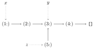
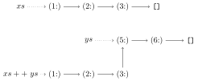
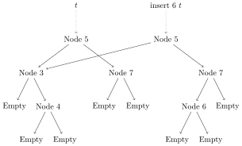

<text-box variant='learningObjectives' name="Learning objectives">

After this section

*   You know how algebraic datatypes work in memory
</text-box>


How Do Algebraic Datatypes Work?
------------------------------------

Remember how lists were represented in memory as linked lists? Let’s look in more detail at what algebraic datatypes look like in memory.

Haskell data forms _directed graphs_ in memory. Every constructor is a node, every field is an edge. Names (of variables) are pointers into this graph. Different names can _share_ parts of the structure. Here’s an example with lists. Note how the last two elements of `x` are shared with `y` and `z`.

```haskell
let x = [1,2,3,4]
    y = drop 2 x
    z = 5:y
```



What happens when you make a new version of a datastructure is called _path copying_. Since Haskell data is immutable, the changed parts of the datastructure get copied, while the unchanged parts can be shared between the old and new versions.

Consider the definition of `++`:

```haskell
[]     ++ ys = ys
(x:xs) ++ ys = x:(xs ++ ys)
```
We are making a copy of the first argument while we walk it. For every `:` constructor in the first input list, we are creating a new `:` constructor in the output list. The second argument can be shared. It is not used at all in the recursion. Visually:



One more way to think about it is this: we want to change the `tail` pointer of the list element `(3:)`. That means we need to make a new `(3:)`. However the `(2:)` points to the `(3:)` so we need a new copy of the `(2:)` as well. Likewise for `(1:)`.

The graphs that we get when working with lists are fairly simple. As a more involved example, here is what happens in memory when we run the binary tree insertion example from earlier in this lecture.

```haskell
insert :: Int -> Tree Int -> Tree Int
insert x Empty = Node x Empty Empty
insert x (Node y l r)
    | x < y = Node y (insert x l) r
    | x > y = Node y l (insert x r)
    | otherwise = Node y l r
```



Note how the old and the new tree share the subtree with 3 and 4 since it wasn’t changed, but the node 7 that was “changed” and all nodes above it get copied.
